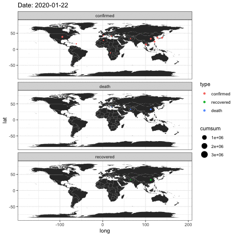
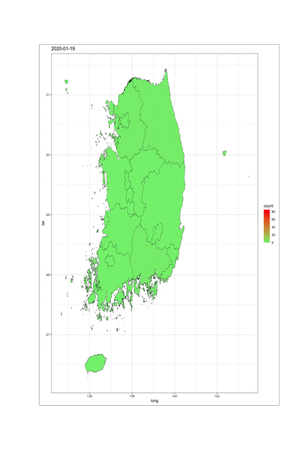
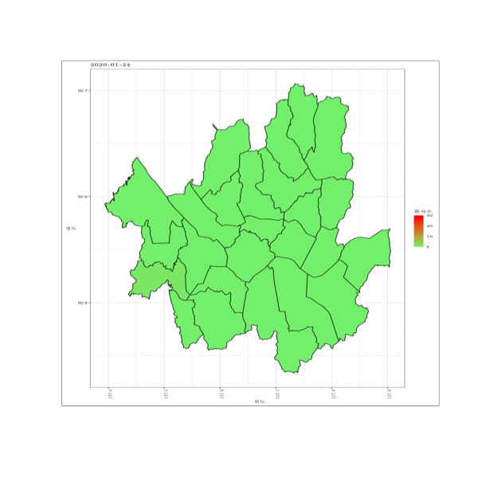
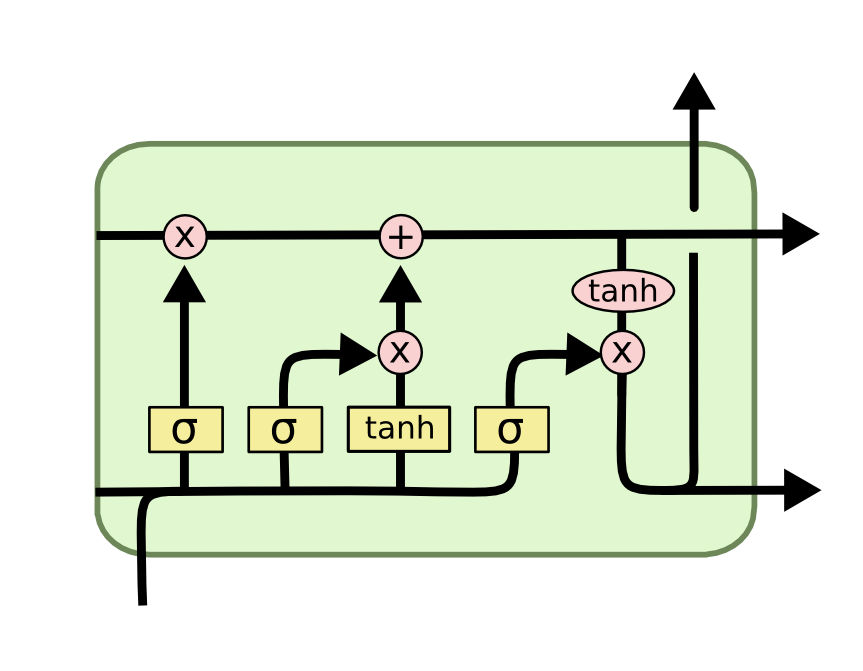

```{r setup, include=FALSE}
knitr::opts_chunk$set(echo = FALSE, include = TRUE, 
                      message = FALSE, warning = FALSE, fig.align = 'center')
library(pROC)
library(crosstalk)
library(magick)
library(forecast)
library(nnet)
library(gam)
library(readxl)
library(data.table)
library(png)
library(ggmap)
library(rpart)
library(knitr)
library(plotrix)
library(pander)
library(survMisc)
library(gtools)
library(rpart.plot)
library(gganimate)
library(animation)
library(broom)
library(tidyverse)
library(mice)
library(rgdal)
library(lubridate)
library(stringr)
library(countrycode)
library(hash)
library(ggplot2)
library(extrafont)
library(ggthemes)
library(plotly)
library(IRdisplay)
library(leaflet)
library(missForest)
library(httr)
library(jsonlite)
library(purrr)

library(tensorflow)
library(keras)
tf_dict <- tf$compat$v1
tf_dict$set_random_seed(3488)

# extrafont::font_import('AppleGothic')
theme_update(text=element_text(family="AppleGothic"))

# install.packages("ggthemes")
ggplot2::theme_set(ggplot2::theme_grey() + ggplot2::theme(text = ggplot2::element_text(family="AppleGothic")))

grDevices::quartzFonts(
  sans =grDevices::quartzFont(rep("AppleGothic",4)),
  serif=grDevices::quartzFont(rep("AppleMyungjo",4))
)
grDevices::pdf.options(family="Korea1")
grDevices::ps.options(family="Korea1")
attach(NULL, name = "KoreaEnv")
assign("familyset_hook",
       function(){
         macfontdevs=c("quartz","quartz_off_screen", "RStudioGD")
         devname=strsplit(names(dev.cur()),":")[[1L]][1]
         if (capabilities("aqua") &&
             devname %in% macfontdevs)
           par(family="sans")
       },
       pos="KoreaEnv")
setHook("plot.new", get("familyset_hook", pos="KoreaEnv"))
setHook("persp", get("familyset_hook", pos="KoreaEnv"))
options(java.parameters=c("-Xmx8g", "-Dfile.encoding=UTF-8"))

theme.ti <- element_text(family="AppleMyungjo", face="bold", size=12) #그래프 제목 스타일 변경
theme.ax <- element_text(family="AppleMyungjo", face="bold", size=10, angle=00, hjust=0.54, vjust=0.5) #그래프 축 이름 스타일 변경
theme.leti<-element_text(family="AppleMyungjo", face="bold") #범례 제목 (legend) 스타일 변경, 범례가 있을 경우에만 쓰세요
theme.lete<-element_text(family="AppleMyungjo") #범례 항목 (legend) 스타일 변경, 범례가 있을 경우에만 쓰세요

kakao_emd_convert <- function (lon, lat, kakao_key)
{
  url <- "https://dapi.kakao.com/v2/local/geo/coord2regioncode.json"
  url_fed_to_get <- paste0(url, "?x=", lon, "&y=", lat)
  address_result <- GET(url_fed_to_get, add_headers(Authorization = str_c("KakaoAK ",
                                                                          kakao_key)))
  json <- content(address_result, as = "text")
  processed_json <- fromJSON(json)
  processed_json$documents
}
```

```{r, out.width = "100%", fig.align='center'}

include_graphics("../figure/covid-19-image.png")
```

# 1. 전 세계 코로나 데이터 소개 

[2019 Novel Coronavirus COVID-19 (2019-nCoV) Data Repository by Johns Hopkins CSSE](https://github.com/CSSEGISandData/COVID-19) 를 통하여 존스홉킨스 대학교에서 공개한 데이터셋으로 많은 데이터사이언티스트들의 코로나 바이러스에 대한 과학적 연구를 장려하기 위하여 공개되었음. 데이터는 WHO는 물론, 전 세계의 질병관리본부(CDC)에서 수집한 정보를 포함하고 있음.

## 분석개요

코로나 바이러스에 대한 간단한 탐색적자료분석 결과와 시각화 작업을 통하여 재미있는 요소를 확인하고자 함은 물론 위험성에 대하여 인식을 고도화함.


```{r}
df_confirmed <- read_csv('https://raw.githubusercontent.com/CSSEGISandData/COVID-19/master/csse_covid_19_data/csse_covid_19_time_series/time_series_19-covid-Confirmed.csv')
df_deaths <- read_csv('https://raw.githubusercontent.com/CSSEGISandData/COVID-19/master/csse_covid_19_data/csse_covid_19_time_series/time_series_19-covid-Deaths.csv')
df_recovered <- read_csv('https://raw.githubusercontent.com/CSSEGISandData/COVID-19/master/csse_covid_19_data/csse_covid_19_time_series/time_series_19-covid-Recovered.csv')
```

raw 데이터는 확진환자, 사망환자, 그리고 완치환자로 총 3개의 데이터셋으로 구성되며, 그 예시중 확진환자 데이터셋은 다음과 같이 각 국가별로 수집된 환자수에 대한 정보를 담고 있음.
```{r}
df_confirmed %>% head() %>% mutate('~' = '...') %>%
  select('Province/State', 'Country/Region', Lat, Long, '1/22/20', '~', last(names(df_confirmed))) %>% 
  pander('원 데이터셋 예시')
```

## 전처리 작업 

1. 열이름 재정의 

2. 변수 내 범주 재정의
* 크루즈쉽 : 일본으로 간주
* 대륙별 지정 국가명으로 변경 

3. 국가별 대륙정보 반영 
* 아시아, 미국, 아프리카, 유럽, 오세아니아 

```{r}
# 확진판정 : df_confirmed
# 사망판정 : df_deaths
# 완치판정 : df_recovered
# df_confirmed %>% head()

# Change colnames
# Cleaning and Preparing Data

df_confirmed <- df_confirmed %>%
  rename(state = 'Province/State', country = 'Country/Region') %>% 
  mutate(country = ifelse(country == "US", "USA",
                          ifelse(country == "Holy See", "Faroe Islands", 
                                 ifelse(country == "Korea, South", 'South Korea', 
                                        ifelse(country == 'Cruise Ship', 'Japan', 
                                               ifelse(country == 'Taiwan*', 'Taiwan', 
                                                      ifelse(country == 'Congo (Kinshasa)', 'Democratic Republic of the Congo', 
                                                             ifelse(country == "Cote d'Ivoire", "Côte d'Ivoire", 
                                                                    ifelse(country == 'Congo (Brazzaville)', 'Republic of the Congo', 
                                                                           ifelse(country == 'Bahamas, The', 'Bahamas', 
                                                                                  ifelse(country == 'Gambia, The', 'Gambia', country)))))))))))

df_deaths <- df_deaths %>%
  rename(state = 'Province/State', country = 'Country/Region') %>% 
  mutate(country = ifelse(country == "US", "USA",
                          ifelse(country == "Holy See", "Faroe Islands", 
                                 ifelse(country == "Korea, South", 'South Korea', 
                                        ifelse(country == 'Cruise Ship', 'Japan', 
                                               ifelse(country == 'Taiwan*', 'Taiwan', 
                                                      ifelse(country == 'Congo (Kinshasa)', 'Democratic Republic of the Congo', 
                                                             ifelse(country == "Cote d'Ivoire", "Côte d'Ivoire", 
                                                                    ifelse(country == 'Congo (Brazzaville)', 'Republic of the Congo', 
                                                                           ifelse(country == 'Bahamas, The', 'Bahamas', 
                                                                                  ifelse(country == 'Gambia, The', 'Gambia', country)))))))))))

df_recovered <- df_recovered %>%
  rename(state = 'Province/State', country = 'Country/Region') %>% 
  mutate(country = ifelse(country == "US", "USA",
                          ifelse(country == "Holy See", "Faroe Islands", 
                                 ifelse(country == "Korea, South", 'South Korea', 
                                        ifelse(country == 'Cruise Ship', 'Japan', 
                                               ifelse(country == 'Taiwan*', 'Taiwan', 
                                                      ifelse(country == 'Congo (Kinshasa)', 'Democratic Republic of the Congo', 
                                                             ifelse(country == "Cote d'Ivoire", "Côte d'Ivoire", 
                                                                    ifelse(country == 'Congo (Brazzaville)', 'Republic of the Congo', 
                                                                           ifelse(country == 'Bahamas, The', 'Bahamas', 
                                                                                  ifelse(country == 'Gambia, The', 'Gambia', country)))))))))))


continents <- hash()
continents['NA'] <- 'North America'
continents['SA'] <- 'South America'
continents['AS'] <- 'Asia'
continents['OC'] <- 'Australia'
continents['AF'] <- 'Africa'
continents['EU'] <- 'Europe'

#Collecting Continent Information
df_confirmed <- df_confirmed %>% 
  mutate(continent = countrycode(sourcevar = country, origin = "country.name", destination = "continent")) %>% 
  filter(!is.na(continent))
df_recovered <- df_recovered %>% 
  mutate(continent = countrycode(sourcevar = country, origin = "country.name", destination = "continent")) %>% 
  filter(!is.na(continent))
df_deaths <- df_deaths %>% 
  mutate(continent = countrycode(sourcevar = country, origin = "country.name", destination = "continent")) %>% 
  filter(!is.na(continent))

# 최종 사용 데이터셋 정의 
df_confirmed_daily <- df_confirmed %>% select(-state) %>% gather(key = "date", "count", -continent, -country, -Lat, -Long)
df_recovered_daily <- df_recovered %>% select(-state) %>% gather(key = "date", "count", -continent, -country, -Lat, -Long)
df_deaths_daily <- df_deaths %>% select(-state) %>% gather(key = "date", "count", -continent, -country, -Lat, -Long)


# 국가/대륙/일자별 이벤트 합계 
corona_daily <- left_join(df_confirmed_daily %>% group_by(country, continent, date) %>%
                            summarise(sum_count = sum(count)) %>% rename(confirmed = sum_count),
                          df_recovered_daily %>% group_by(country, continent, date) %>% 
                            summarise(sum_count = sum(count)) %>% rename(recovered = sum_count)) %>% 
  left_join(df_deaths_daily %>% group_by(country, continent, date) %>% 
              summarise(sum_count = sum(count)) %>% rename(death = sum_count)) %>% 
  filter(!is.na(confirmed))

corona_daily %>% 
  head() %>% pander('국가/대륙/일자별 코로나 질병 이벤트 합계 ')
```

주어진 데이터를 통하여 구축한 자료구조는 위와 같으며, 자료 내 관측치 중 결측값은 없음.

```{r, eval=FALSE}
## na 합계 
sapply(corona_daily, function(x){is.na(x) %>% sum()}) %>% 
  as.table() %>% as.data.frame() %>% rename(변수 = Var1, 결측치수 = Freq) %>% 
  pander("변수별 결측치 수")

```


## 대륙별 코로나 추세 확인 

* 아프리카, 아메리카, 아시아, 유럽, 오세아니아 

* 코로나 활동 환자 수 : active = confirmed - recovered - deaths

* 아시아가 발병근원지인 코로나 바이러스는 아시아, 유럽 이외 순으로 코로나 활동 환자 수가 많음.

```{r}
corona_conti_count <- corona_daily %>% 
  group_by(continent, date) %>% 
  summarise(confirmed = sum(confirmed),
            recovered = sum(recovered),
            death = sum(death)) %>% 
  mutate(active = confirmed - recovered - death) %>% 
  mutate(date = lubridate::mdy(date)) %>% 
  gather(type, count, confirmed, recovered, death, active) 

# corona_cum_count %>% 
#   ggplot(aes(x = date, y = count, col = type, group = type)) + geom_line() + facet_grid(~continent) +
#   theme(axis.text.x = element_text(angle = 90, hjust = 1))

# corona_conti_count %>% filter(continent == 'Americas') %>% ungroup %>% select(count) %>% t() %>% as.vector()
corona_conti_count %>% ungroup%>% 
  filter(type == 'active') %>% 
  group_by(continent) %>%
  filter(!is.na(count)) %>% 
  summarise(sum_count = sum(count)) %>% 
  mutate(country_nth = table(corona_daily$continent) / corona_conti_count$date %>% unique() %>% length(),
         mean_count = sum_count/country_nth) %>%
  pander('대륙별 국가 수(평균 포함) 및 코로나 활동 환자 수')
```

* 대륙별 코로나 환자수 유형 

대륙별 코로나 환자수는 **아시아**가 압도적으로 많으며, 그 다음으로 유럽이 많음.
아시아의 경우, 점차적으로 완치환자가 증가하며, 활동환자는 줄어드는 추세를 보여 코로나 바이러스가 수그러드는 듯이 보이나, 이외의 대륙은 코로나 바이러스가 현재진행중임. 

```{r}
# corona_cum_count %>% 
#   mutate(continent_regroup = ifelse(!(continent%in%c('Asia', 'Europe')), 'ETC', continent)) %>% 
#   group_by(continent_regroup, date, type) %>% 
#   summarise(count = sum(count)) %>% 
#   group_by(continent_regroup, type) %>%
#   arrange(date) %>% 
#   mutate(cum_count = cumsum(count)) %>% 
#   ggplot(aes(x = date, y = cum_count, col = type, group = type)) + geom_line() +
#   facet_wrap(~continent_regroup, scales = "free_y") + 
#   labs(y = '누적 환자 수', x = '날짜', col = '유형') +
#   theme(axis.text.x = element_text(angle = 90, hjust = 1)) + theme_bw()
# corona_conti_count$date %>% max()
corona_conti_count %>% 
  filter(date <= '2020-03-22') %>% 
  group_by(continent, type) %>%
  arrange(date) %>% 
  ggplot(aes(x = date, y = count, col = type, group = type)) + geom_line() +
  facet_wrap(~continent, scales = "free_y") + 
  labs(y = '환자 수', x = '날짜', col = '유형') +
  theme_bw() + 
  theme(axis.title.x = theme.ax, axis.title.y = theme.ax, plot.title = theme.ti, legend.title = theme.leti, legend.text = theme.lete,
        axis.text.x = element_text(angle = 90, hjust = 1))
```

## 국가별 코로나 추세 확인 

* 가장 영향력이 심한 상위 10개국에 대한 국가별 활동 환자 수 
```{r}
corona_nat_count <- corona_daily %>% 
  group_by(country, date) %>% 
  summarise(confirmed = sum(confirmed),
            recovered = sum(recovered),
            death = sum(death)) %>% 
  mutate(active = confirmed - recovered - death) %>% 
  mutate(date = lubridate::mdy(date)) %>% 
  gather(type, count, confirmed, recovered, death, active) 

corona_affect_top10 <- corona_nat_count %>% 
  filter(date == max(date)) %>% 
  group_by(country, type) %>%
  summarise(합계 = sum(count)) %>% 
  filter(type == 'active') %>%
  arrange(desc(합계)) %>% head(10) 

corona_affect_top10 %>% 
  pander('코로나 영향이 가장 심한 상위 10개국 활동 환자 수 ')
```

* 상위 10개 국의 시기별 환자수 변화 

중국은 현재, 활동 환자수가 10000명 이하로 떨어져 코로나가 끝났다고 말하고 있으며, 한국과 일본 또한 점차 활동 환자수가 감소하고 있는 추세를 띄고 있다.
하지만 유럽 지역은 대부분 늦게 전파된 바이러스로 인하여 급속도로 환자수가 증가하고 있다.

```{r}
corona_nat_count %>% 
  group_by(country, type) %>%
  arrange(date) %>% 
  filter(country %in% corona_affect_top10$country) %>% 
  ggplot(aes(x = date, y = count, col = type, group = type)) + geom_line() +
  facet_wrap(~country, scales = "free_y") + 
  labs(y = '환자 수', x = '날짜', col = '유형') +
  theme_bw() + 
  theme(axis.title.x = theme.ax, axis.title.y = theme.ax, plot.title = theme.ti, legend.title = theme.leti, legend.text = theme.lete,
        axis.text.x = element_text(angle = 90, hjust = 1))
```

## 사망률 

앞서 확인한 가장 영향력이 심한 상위 10개국의 코로나 환자의 치사율. 즉, 사망률을 확인해보았음.

```{r}
corona_daily %>% 
  group_by(country, date) %>% 
  summarise(confirmed = sum(confirmed),
            recovered = sum(recovered),
            death = sum(death)) %>% 
  mutate(active = confirmed - recovered - death,
         mortality = ifelse(confirmed == 0, 0, death / (confirmed + recovered))) %>% 
  mutate(date = lubridate::mdy(date)) %>% 
  gather(type, count, mortality) %>% 
  group_by(country) %>%
  filter(country %in% corona_affect_top10$country) %>% 
  ggplot(aes(x = date, y = count)) + geom_line() +
  facet_wrap(~country, scales = "free_y") + 
  labs(y = '환자 수', x = '날짜', col = '유형') +
  theme_bw() + 
  theme(axis.title.x = theme.ax, axis.title.y = theme.ax, plot.title = theme.ti,
        legend.title = theme.leti, legend.text = theme.lete,
        axis.text.x = element_text(angle = 90, hjust = 1))
```

프랑스와 이탈리아 그리고 미국은 상대적으로 높은 사망률을 보이고 있음. 안타까운 사실로, 대부분의 국가에서 점차 사망률이 증가하는 것이 관측되고 있음.


## 지도상 시각화 

1. 세계 환자수 그림 

* 주황색 : 국가별 covid-19 확진자 수 

* 빨간색 : 국가별 사망한 환자 수

* 초록색 : 국가별 완치한 환자 수

```{r}
cv_data_for_plot <- df_confirmed_daily %>% mutate(type = 'confirmed') %>% 
  rbind(df_recovered_daily %>% mutate(type = 'recovered')) %>% 
  rbind(df_deaths_daily %>% mutate(type = 'death'))  %>% 
  filter(count > 0) %>% 
  group_by(country, continent, Lat, Long, type) %>% 
  summarise(count = sum(count)) %>% 
  mutate(log_cases = log1p(count)) %>% 
  ungroup()

cv_data_for_plot.split <- cv_data_for_plot %>% split(cv_data_for_plot$type)
pal <- colorFactor(c("orange", "red","green"), domain = c("confirmed", "death","recovered"))
map_object <- leaflet() %>% addProviderTiles(providers$Stamen.Toner)

get_each_df <- function(df) {
    map_object <<- map_object %>%
      addCircleMarkers(data=cv_data_for_plot.split[[df]],
                 lng=~Long, lat=~Lat,
                 color = ~pal(type),
                 stroke = FALSE,
                 fillOpacity = 0.8,
                 radius = ~log_cases,
                 group = df,
#                 clusterOptions = markerClusterOptions(removeOutsideVisibleBounds = F),
                 labelOptions = labelOptions(noHide = F,
                                             direction = 'auto'))
}

names(cv_data_for_plot.split) %>%
  purrr::walk(get_each_df)

map_object %>%
  addLayersControl(
    overlayGroups = names(cv_data_for_plot.split),
    options = layersControlOptions(collapsed = FALSE)
  )

```

그림을 보면, 아시아 지역은 완치한 환자들의 수가 많아 시각적으로 두드러지게 표현되지만, 좌측에 보이는 유럽지역은 완치한 환자수가 적고, 확진자와 사망자 수가 시각적으로 표현된 것을 확인할 수 있음.

2. 세계 COVID-19 환자 일자별 변화  

```{r, eval=FALSE}

map.world <- map_data("world")

ts_wordwide_corona <- df_confirmed_daily %>% mutate(type = 'confirmed') %>% 
  rbind(df_recovered_daily %>% mutate(type = 'recovered')) %>% 
  rbind(df_deaths_daily %>% mutate(type = 'death'))  %>% 
  filter(count > 0) %>% mutate(date = mdy(date)) 
# %>% group_by(country, type, date) %>% summarise(count = sum(count))
ts_wordwide_corona_cum <- ts_wordwide_corona %>% group_by(country, type, date) %>% 
  summarise(count = sum(count)) %>%
  mutate(cumsum = cumsum(count)) %>% 
  left_join(ts_wordwide_corona %>% group_by(country) %>%
              summarise(lat = mean(Lat), long = mean(Long))) %>% 
  select(date, country, type, long, lat, cumsum)


wordmap <- ggplot() + 
  geom_polygon(data = map.world, aes(x=long, y=lat, group=group))  +
  geom_point(data =ts_wordwide_corona_cum, aes(x=long, y=lat, size = cumsum, col = factor(type, levels=c('confirmed', 'recovered', 'death')))) + 
  facet_wrap(~type, nrow=3) + 
  transition_time(date) + theme_bw() + labs(title = "Date: {frame_time}", col = 'type') +
  shadow_wake(wake_length = 0.1, alpha = FALSE)

animate(wordmap, end_pause = 30)
# ts_wordwide_corona_plotly <- map.world %>% 
```

```{r}

```

중국 우한을 시작으로 퍼지게 된 코로나바이러스는 시간이 흐름에 따라 유럽, 전미 지역으로 퍼지는 것을 확인하였음.

# 2. 국내 코로나 동선 추적 데이터 

[마인즈랩, '코로나19 동선 추적 데이터셋'](https://github.com/ThisIsIsaac/COVID-19_Korea_Dataset) 를 통하여 마인즈 랩에서 공개한 국내 코로나 19 동선 추적 데이터셋으로 과학적 연구 진행이 가능함.

## 분석개요

국내 코로나 바이러스 환자에 대하여 진행한 간단한 탐색적자료분석 결과와 동선 추적 데이터셋을 통하여 과학적으로 재미있는 요소를 확인하고자 함.
공개된 데이터셋은 환자정보에 대한 데이터셋과 이동경로 데이터셋으로 구분된다. 

```{r}
patients <- read_csv("../data/COVID-19_Korea_Dataset-master/Covid19_Dataset/patients.csv")
route_data <- read_csv("../data/COVID-19_Korea_Dataset-master/Covid19_Dataset/routes.csv")
 
patients

patients %>% sapply(function(x){(is.na(x) %>% sum())/nrow(patients)}) %>%
  as.table() %>% as.data.frame() %>% rename(변수 = Var1, 결측비율 = Freq) %>% 
  pander("변수별 결측값 비율")

```

환자데이터셋의 경우 결측비율이 너무 많아 분석에서의 사용이 불가능해보임.(확진자수 급증에 따라 성별정보는 집계가 안 된 것으로 보임)

```{r}
route_data 

route_data %>% sapply(function(x){(is.na(x) %>% sum())/nrow(route_data)}) %>%
  as.table() %>% as.data.frame() %>% rename(변수 = Var1, 결측비율 = Freq) %>% 
  pander("변수별 결측값 비율")
```

동선 데이터셋의 경우 환자번호에 따라 지역정보인 province의 결측치 보정이 필요하며, 방문유형(type)이나, 지역번호(local_id)는 결측치 보정이 불가능함.


## 전처리 작업 

1. 동선데이터의 경우 위경도, 지역정보 등의 추정은 어느정도 비슷한 지역에 머물럿을것이라 예측이 가능하지만, type, local_id 등의 변수는 추정이 불가능함.
확진자당 해당 요일에서 발생한 결측값을 보정하기 위하여, 요일당 방문지역에 대한 확률값을 계산하여 확률적으로 보정하였음.

2. long/lat 위경도 정보 또한 다중대체법(Multiple Imputation by chained equations)을 통하여 보정하였음.

3. KakaoAPI를 이용한 위경도별 행정구역 정보 수집 : 대상이 모호하여, 시도 정보만 수집하였음.
```{r, message=FALSE}
patient_route <- left_join(route_data, patients %>% select(-local_id, -province))

patient_route_province_dict <- patient_route %>% group_by(global_id, start, end, province) %>%
  filter(!is.na(province)) %>% 
  summarise(count = n()) %>% 
  mutate(tot_count = sum(count),
         prob = count/tot_count) %>% 
  select(-count, -tot_count) %>% 
  rename(province_impute = province)

get_func_patient <- patient_route_province_dict %>% 
  group_by(global_id, start, end) %>%
  mutate(count = n()) %>% 
  select(-count) %>% group_by(global_id, start, end) %>%
  spread(province_impute, prob) %>% 
  mutate_all(function(x){ifelse(is.na(x), 0, x)})

## 확률값으로 보정 
province_nmes <- get_func_patient %>% ungroup %>% select(-global_id, -start, -end) %>% names() 
value_falt <- get_func_patient %>% ungroup %>% select(-global_id, -start, -end)
get_func_patient$imputed <- ''
for(i in 1:nrow(get_func_patient)){
  arr <- value_falt[i,] %>% as.data.frame() %>% as.vector()
  get_func_patient$imputed[i] <- sample(province_nmes, 1, prob=arr)
}

patient_route_imputed <- patient_route %>% left_join(get_func_patient %>% select(global_id, start, end, imputed)) %>% 
  mutate(province = ifelse(is.na(province), imputed, province)) %>% 
  select(-imputed, -disease, -group)

set.seed(0)
for_impute <- patient_route_imputed %>% select(global_id, start, end, latitude, longitude, province)
mice_res <- mice(for_impute, printFlag=FALSE, method='rf')

patient_route_imputed <- patient_route_imputed %>% as.data.frame()
patient_route_imputed[, c('global_id', 'start', 'end', 'latitude', 'longitude', 'province')] <- complete(mice_res)
# patient_route_imputed %>% sapply(function(x){is.na(x) %>% sum()})

```

```{r, eval=FALSE}
kakao_key <- "4febb0939357ec9fee82262801d5314b"
patient_route_imputed$SI <- NA
for(i in 1:nrow(patient_route_imputed)){
  tmp <- kakao_emd_convert(lon = patient_route_imputed$longitude[i], 
                           lat = patient_route_imputed$latitude[i],
                           kakao_key = kakao_key)
  res <- tmp[tmp$region_type == 'H', 'region_1depth_name']
  patient_route_imputed$SI[i] <- res
}
patient_route_imputed

saveRDS(patient_route_imputed, file='../data/processed_patient_route_imputed.rds')
```

```{r}
processed_patient_route_imputed <- readRDS('../data/processed_patient_route_imputed.rds')
```

## 국내 지역별 코로나 환자의 활동성 정보 

* 데이터는 전체 환자의 이동경로를 포함하고 있지 않기에, 이 결과를 통하여 단정지을 수 없음.

* 서울과 대구/경북 지역에 유난히 많은 활동량이 관측되었음.

```{r}
# patient_route_imputed %>% group_by(province) %>% summarise(count = n()) %>% arrange(desc(count))

map_object_korea <- leaflet() %>% addProviderTiles(providers$Stamen.Toner)

map_object_korea %>%
  addCircleMarkers(data=processed_patient_route_imputed,
                   lng=~longitude, lat=~latitude,
                   color = ~pal(type),
                   stroke = FALSE,
                   fillOpacity = 0.8,
                   clusterOptions = markerClusterOptions(removeOutsideVisibleBounds = F),
                   labelOptions = labelOptions(noHide = F,
                                               direction = 'auto')) %>%
  addLayersControl(
    options = layersControlOptions(collapsed = FALSE)
  )

```

## 2.1 shape 파일을 이용한 추세별 변화양상 확인 

1. 환자 이동경로 자료 내 각 지역을 시도 정보로 재분류과정  

* 위경도 정보를 바탕으로 시도정보로 구분하였음

```{r}
# suprisingly, if i use another inventory to read a shp in mac, there is an event error occured
korea_shp <- readOGR(dsn="../../../Macintosh HD/Users/son/Desktop/son/Hana Bank/CTPRVN_201905/", 
                     layer="TL_SCCO_CTPRVN", stringsAsFactors=FALSE,  verbose=FALSE)

# plot(korea_shp, axes = T)
from_crs = CRS("+proj=tmerc +lat_0=38 +lon_0=127 +k=1 +x_0=200000 +y_0=500000 +ellps=bessel +units=m")
to_crs = CRS("+proj=longlat +ellps=WGS84 +datum=WGS84 +no_defs")
proj4string(korea_shp) <- from_crs
korea_shp_tr <- spTransform(korea_shp, to_crs)
korea_fty <- fortify(korea_shp_tr)
# korea_shp_tr@data
# as.character(1:16)
korea_shp_fit <- korea_shp_tr@data %>% select(-CTP_KOR_NM) %>% mutate(id = as.character(0:16)) %>% 
  right_join(korea_fty)

# 두 데이터 내 영어명 축약 및 통일해야함. patient 정보에서 해결할 것 
# korea_shp_tr@data$CTP_ENG_NM %>% unique()
#  [1] "Seoul"             "Busan"             "Daegu"             "Incheon"           "Gwangju"           "Daejeon"           "Ulsan"            
# [8] "Sejong-si"         "Gyeonggi-do"       "Gangwon-do"        "Chungcheongbuk-do" "Chungcheongnam-do" "Jeollabuk-do"      "Jellanam-do"      
#[15] "Gyeongsangbuk-do"  "Gyeongsangnam-do"  "Jeju-do" 
# patient_activity_time$province %>% unique()
# processed_patient_route_imputed$SI %>% unique()

processed_patient_route_imputed <- processed_patient_route_imputed %>% 
  mutate(SI = ifelse(SI == '', province, SI)) %>%
  mutate(SI = factor(SI, levels = c("서울특별시",  "부산광역시", "대구광역시", "인천광역시", "광주광역시", "대전광역시", "울산광역시",
                                    "세종특별자치시", "경기도", "강원도", "충청북도", "충청남도", "전라북도", "전라남도", 
                                    "경상북도", "경상남도", "제주특별자치도"),
                     labels = c("Seoul", "Busan", "Daegu", "Incheon", "Gwangju", "Daejeon", "Ulsan", 
                                "Sejong-si", "Gyeonggi-do", "Gangwon-do", "Chungcheongbuk-do", "Chungcheongnam-do", "Jeollabuk-do",
                                "Jellanam-do", "Gyeongsangbuk-do", "Gyeongsangnam-do", "Jeju-do")))

```

2. shape 파일이란 ? 

shapefile 형식은 지리 정보에 널리 사용되는 지형 공간 벡터 데이터 형식이다. 흔히 말하는 GIS에 적합한 데이터형태이며, shapefile 형식은 예를 들어 우물, 강 및 호수를 나타내는 점, 선 및 다각형과 같은 벡터 기능을 공간적으로 설명한다. 이때, 각 항목에는 일반적으로 이름이나 온도로 표현하는 속성 정보가 포함되어 있습니다.

```{r, fig.height=6, fig.width=4, fig.align='center'}
patient_activity_time <- processed_patient_route_imputed %>% 
  group_by(SI, start) %>% 
  summarise(count = n()) %>% 
  mutate(date_time = lubridate::mdy(start)) %>% 
  select(-start) %>% 
  rename(CTP_ENG_NM = SI) %>% ungroup %>% 
  mutate(CTP_ENG_NM = ifelse(is.na(CTP_ENG_NM), 'NA', as.character(CTP_ENG_NM)))

time_series <- patient_activity_time$date_time %>% unique() %>% sort()
time_series <- time_series[!str_detect(time_series, "2020-09-08")]
sido_nms <- patient_activity_time$CTP_ENG_NM %>% unique()

each_daily <- data.frame(date_time=rep(time_series, each=17), CTP_ENG_NM = rep(sido_nms[1:17], length(time_series))) %>% 
  left_join(patient_activity_time) %>% mutate(count = ifelse(is.na(count), 0, count)) %>% ungroup()

ggplot_korea_map <- ggplot(data =  korea_shp_fit ,
                           aes(x=long, y=lat, group=group)) +
  geom_polygon(color = "black", fill = 'grey', size = 0.1) + theme_bw()

ggplot_korea_map
# ggsave(paste0("../figure/figure_time_", "raw", ".png"))
```

위 그림은 대한민국의 행정구역 경계(시도 기준)를 통하여 표현된 shapefile에 대한 시각화 정보임.

3. 일자별 바이러스 환자의 활동성 비교  

공개된 데이터셋 내에는 1월 말부터 3월 초까지의 환자가 방문한 지역에 대한 위치정보가 포함되어 있음.

```{r, eval=FALSE}
full_dataset <- korea_shp_fit %>% 
  left_join(each_daily) %>% 
  mutate(count = ifelse(is.na(count), 0, count))

for(i in 1:length(time_series)){
  full_dataset %>% 
    filter(date_time == time_series[i]) %>% 
    ggplot(aes(x=long, y=lat, fill = count, group=group)) +
    geom_polygon(color = "black", size = 0.1) + theme_bw() + 
    labs(title = time_series[i]) +
    scale_fill_gradient(limit = c(0, 85), low = 'lightgreen', high = 'red')
  
  print(str_c(i, "th dataset saved ... "))
  ggsave(paste0("../figure/for_animate/figure_time_", str_replace_all(time_series[i], "-", ""), ".png"))
}


#animation speed, seconds per frame
# gganimate(ggplot_korea_map, title_frame = FALSE)
```

```{r, eval=FALSE}
dir.create('../figure/for_gif')
png(file="../figure/for_gif/example%03d.png",  width=600, heigh=900)
  for (i in 1:length(time_series)){
    img <- png::readPNG(paste0("../figure/for_animate/", list.files('../figure/for_animate/')[i]))
    plot.new()
    rect(0, 0, 1, 1, col = "white")
    rasterImage(img, 0, 0, 1, 1)
    animation::ani.pause()
  }
dev.off()

setwd("../figure/for_gif")
system(command= "convert -delay 40 *.png corona_activity.gif")
setwd("../../code")
## go to terminal in /figure/for_gif
## convert -delay 10 *.png corona_activity.gif
# file.remove(list.files(pattern=".png"))
```

```{r, fig.height=4, fig.width=3, fig.align='center', out.width='60%'}
# library(caTools)
# gif_res <- read.gif("../figure/for_gif/corona_activity.gif")

```

3월초 급증한 코로나 환자수를 보아, 환진 판정을 받은 환자들이 코로나바이러스 잠재기간인 2월 중순 ~ 말 시점에 활발히 움직였기에, 위와 같은 결과가 도출되었음.


# 3. 국내 코로나 동선 추적 데이터(서울시)

```{r}
### shapefile
seoul_shp <- readOGR(dsn="../../../Macintosh HD/Users/son/Desktop/son/Hana Bank/SIG_201905/", 
                     layer="TL_SCCO_SIG", stringsAsFactors=FALSE,  verbose=FALSE)

seoul_shp <- seoul_shp[str_detect(seoul_shp@data$SIG_CD, "^11"),]
# plot(korea_shp, axes = T)
from_crs = CRS("+proj=tmerc +lat_0=38 +lon_0=127 +k=1 +x_0=200000 +y_0=500000 +ellps=bessel +units=m")
to_crs = CRS("+proj=longlat +ellps=WGS84 +datum=WGS84 +no_defs")
proj4string(seoul_shp) <- from_crs
seoul_shp_tr <- spTransform(seoul_shp, to_crs)

### dataset 

seoul_patients <- read_csv("../data/COVID-19_Korea_Dataset-master/Covid19_Dataset/Seoul/seoul_patients.csv")
seoul_route <- read_csv("../data/COVID-19_Korea_Dataset-master/Covid19_Dataset/Seoul/seoul_routes.csv")

# seoul_patients
# seoul_route
# seoul_shp_tr
```

## 분석개요 

다소 결측값의 비율이 적은 서울시 코로나확진자 데이터셋을 이용하여 그들의 이동경로와 감염사유 등을 통하여 인사이트를 도출함.
서울시의 경우, 확진자의 동선이 역학조사를 통하여 다소 상세하게 기록되고 있음.

1. 환자정보 데이터셋 

```{r}
# seoul_route %>% group_by(type) %>% summarise(count = n()) %>% arrange(desc(count))
seoul_patients %>% sapply(function(x){(is.na(x) %>% sum())/nrow(seoul_patients)}) %>%
  as.table() %>% as.data.frame() %>% rename(변수 = Var1, 결측비율 = Freq) %>% 
  pander("환자정보 자료 변수별 결측값 비율")
```

2. 이동경로 정보 데이터셋 

```{r}
seoul_route %>% sapply(function(x){(is.na(x) %>% sum())/nrow(seoul_route)}) %>%
  as.table() %>% as.data.frame() %>% rename(변수 = Var1, 결측비율 = Freq) %>% 
  pander("이동경로 정보 변수별 결측값 비율")
```

## 전처리 작업 

### 1. 열 제거 및 결측치 제거 

* 감염경로(infected_by)는 자료 내 관측치가 많으며, 감염경로 환자번호의 최대 수가 4로 무의미하여 제거함.

```{r}
seoul_patients %>% group_by(infected_by) %>% summarise(count = n()) %>% arrange(desc(count)) %>% head() %>% pander('상위 6개 감염경로(환자번호)')

```

* 여행경로(travel_history) 또한 자료 내 관측치가 많으며, 최대 수가 4로 무의미하여 제거함.

```{r}
seoul_patients %>% group_by(travel_history) %>% summarise(count = n()) %>% arrange(desc(count)) %>% head() %>% pander('상위 6개 여행경로(여행지)')

seoul_patients <- seoul_patients %>% select(-infected_by, -travel_history)
```

* 시 정보가 결측치인 관측치는 감염사유와 지역정보를 통하여 잘못 기록된 데이터로 판단하여 제거함.
```{r}
seoul_patients %>% filter(is.na(city)) %>% pander('잘못 오기된 자료 제거')

seoul_patients <- seoul_patients %>% filter(!is.na(city)) 
```

### 2. 재범주화 

1. 구로구콜센터 
1. 성동구주상복합
1. 병원발
1. 종교활동발(교회, 신천지3명 포함)
1. 확진자접촉 
1. 외부지역(해외, 대구 등 포함)
1. 조사중
1. 기타 

아래의 사유를 8개 범주로 재범주화하여 진행함.
```{r}
infect_reason <- seoul_patients %>% group_by(infection_reason) %>% 
  summarise(count = n()) %>%
  mutate(category = c('기타', '기타', '확진자접촉', '확진자접촉', '확진자접촉', '확진자접촉', '확진자접촉',
                      '외부지역', '병원발', '종교활동발', '병원발', '구로구콜센터', '종교활동발', 
                      '병원발', '외부지역',  '성동구주상복합', '병원발', '종교활동발', '종교활동발',
                      '기타', '조사중')) %>% 
  select(infection_reason, category, count) %>% arrange(desc(count))

infect_reason %>% pander('감염사유 재범주화 및 비중')

seoul_patients <- seoul_patients %>% 
  mutate(infection_reason = factor(infection_reason, 
                                   levels = infect_reason$infection_reason, 
                                   labels = infect_reason$category))
```


## 시각화 

### 1. 요소별 확진자 수 비교 

1. 나이대별 확진자 수 

```{r}
seoul_patients %>%
  group_by(birth_year) %>%
  mutate(age = 2021 - birth_year) %>% 
  group_by(sex, age) %>%
  summarise(count = n()) %>% 
  ggplot(aes(x=age, y=count, col=sex)) + geom_smooth(formula = y~x, method = 'loess') +
  theme_bw() + 
  labs(x='나이', y='환자수', col = '성별') +
  theme(axis.title.x = theme.ax,
        axis.title.y = theme.ax, 
        plot.title = theme.ti,
        legend.title = theme.leti,
        legend.text = theme.lete,
        axis.text.x = element_text(family="AppleMyungjo", face='bold', angle = 90, hjust = 1))

```

spline 결과 내 구간의 폭을 보았을 때, 30대 구간에서 여성에 비하여 남성의 확진자 수가 많고, 40-50대 여성의 환자 수가 많은 것을 확인할 수 있음.

2. 서울시 내 감염사유별 확진자 수 

```{r}
seoul_patients %>% 
  group_by(infection_reason, sex) %>% 
  summarise(count = n()) %>% 
  ggplot(aes(x = reorder(infection_reason, -count), y = count, fill=sex)) +
  geom_bar(stat='identity') +
  theme_bw() + 
  labs(x='감염사유', y='환자수', col='성별') +
  theme(axis.title.x = theme.ax,
        axis.title.y = theme.ax, 
        plot.title = theme.ti,
        legend.title = theme.leti,
        legend.text = theme.lete,
        axis.text.x = element_text(family="AppleMyungjo", face='bold', angle = 90, hjust = 1))
```

8개 범주에 대한 확진자들의 감염사유는 위와 같이 확진자를 통한 접촉이 많고, 다음으로 집단감염 형태의 사유로 구성됨.
구로구콜센터, 병원발에서 여성의 성비가 높게 나오고, 이외에 요소에서 남성의 성비가 높게 나옴. 앞에서 구로구콜센터의 성비와 확인한 40-50대의 여성의 성비를 비교하였을 떄, 구로구 콜센터의 직원이 주로 40-50대의 여성일 것이라 추측 가능함.

3. 일자별 확진자 수 

```{r}
seoul_patients <- seoul_patients %>% mutate(date_time = mdy(confirmed_date))

# data.frame(date_time = rep(seoul_patients$date_time %>% unique(), each = length(seoul_shp_tr$SIG_ENG_NM)),
#            city = rep(seoul_shp_tr$SIG_ENG_NM, length(seoul_patients$date_time %>% unique()))) %>% 
#   left_join(seoul_patients %>% group_by(date_time, city) %>% summarise(count = n())) %>% 
#   mutate(count = ifelse(is.na(count), 0 , count)) %>% 
seoul_patients %>% group_by(date_time) %>% summarise(count = n()) %>% 
  ggplot(aes(x=date_time, y=count)) +
  geom_line() + theme_bw() +  
  labs(x='일자', y='환자수') +
  theme(axis.title.x = theme.ax,
        axis.title.y = theme.ax, 
        plot.title = theme.ti,
        legend.title = theme.leti,
        legend.text = theme.lete,
        axis.text.x = element_text(family="AppleMyungjo", face='bold', angle = 90, hjust = 1)) 
```
일자별 확진자 수는 3월초 급증하다가, 다소 감소한 추세를 보이고 있음.

4. 서울시 내 거주지역별 확진자 수 

```{r}
city_patient_count <- seoul_patients %>% 
  group_by(city) %>% 
  summarise(count = n()) %>% rename(SIG_ENG_NM = city)

fortify(seoul_shp_tr, region = 'SIG_CD') %>% rename(SIG_CD = id) %>% 
  left_join(seoul_shp_tr@data %>% select(SIG_CD, SIG_ENG_NM) %>%
              left_join(city_patient_count) %>% mutate(count = ifelse(is.na(count), 0, count))) %>% 
  ggplot(aes(x=long, y=lat, group=group, fill=count)) + geom_polygon(col='black') + theme_bw() +
  labs(x='위도', y='경도', fill = '환자수') +
  theme(axis.title.x = theme.ax,
        axis.title.y = theme.ax, 
        plot.title = theme.ti,
        legend.title = theme.leti,
        legend.text = theme.lete,
        axis.text.x = element_text(family="AppleMyungjo", face='bold', angle = 90, hjust = 1)) +
  scale_fill_gradient(low = 'lightgreen', high = 'red')
# seoul_patients %>% filter(city == 'Jungnang-gu')
```

확진자들은 중랑구, 금천구, 서대문구, 서초구 순으로 거주자가 많음.

5. 일자/거주지역별 확진자수 변화

```{r, eval=FALSE}
each_daily_seoul <- data.frame(date_time = rep(seoul_patients$date_time %>% unique(), each = length(seoul_shp_tr$SIG_ENG_NM)),
           city = rep(seoul_shp_tr$SIG_ENG_NM, length(seoul_patients$date_time %>% unique()))) %>%
  left_join(seoul_patients %>% group_by(date_time, city) %>% summarise(count = n())) %>%
  mutate(count = ifelse(is.na(count), 0 , count)) %>% 
  rename(id = city)

each_daily_seoul_cum <- each_daily_seoul %>% arrange(date_time) %>% group_by(id) %>% 
  mutate(cum_count = cumsum(count)) %>% 
  select(date_time, id, cum_count) %>% rename(count = cum_count)

full_dataset_seoul <- full_join(each_daily_seoul_cum, fortify(seoul_shp_tr, region = 'SIG_ENG_NM'))

full_dataset_seoul$count %>% summary
time_seriese_seoul <- seoul_patients$date_time %>% unique() %>% sort()
for(i in 1:length(time_seriese_seoul)){
  full_dataset_seoul %>% 
    filter(date_time == time_seriese_seoul[i]) %>% 
    ggplot(aes(x=long, y=lat, group=group, fill=count)) + geom_polygon(col='black') + theme_bw() +
    labs(x='위도', y='경도', fill = '환자수',title = time_seriese_seoul[i]) +
    theme(axis.title.x = theme.ax,
          axis.title.y = theme.ax, 
          plot.title = theme.ti,
          legend.title = theme.leti,
          legend.text = theme.lete,
          axis.text.x = element_text(family="AppleMyungjo", face='bold', angle = 90, hjust = 1),
          axis.title = element_text(size = 20, face = 'bold')) +
    scale_fill_gradient(limit = c(0, 30), low = 'lightgreen', high = 'red')
  print(str_c(i, "th dataset saved ... "))
  ggsave(paste0("../figure/for_animate_seoul/figure_time_seoul_", str_replace_all(time_seriese_seoul[i], "-", ""), ".png"))
}

dir.create('../figure/for_gif_seoul')
png(file="../figure/for_gif_seoul/example%03d.png",  width=600, heigh=600)
  for (i in 1:length(time_seriese_seoul)){
    img <- png::readPNG(paste0("../figure/for_animate_seoul/", list.files('../figure/for_animate_seoul/')[i]))
    plot.new()
    rect(0, 0, 1, 1, col = "white")
    rasterImage(img, 0, 0, 1, 1)
    animation::ani.pause()
  }
dev.off()

setwd('../figure/for_gif_seoul/')
system(command= "convert -delay 80 *.png corona_activity.gif")

setwd('../../code/')
```

```{r, fig.height=4, fig.width=3, fig.align='center', out.width='85%'}

```

6. 서울시 내 활동지역 정보 

```{r}
map_object_seoul <- leaflet() %>% addProviderTiles(providers$Stamen.Toner) %>% 
  setView(lng = 126.95, lat = 37.5, zoom = 12) 

map_object_seoul %>%
  addCircleMarkers(data=seoul_route %>% filter(latitude >= 37 & !is.na(latitude)),
                   lng=~longitude, lat=~latitude,
                   color = ~pal(type),
                   stroke = FALSE,
                   fillOpacity = 0.8,
                   clusterOptions = markerClusterOptions(removeOutsideVisibleBounds = F),
                   labelOptions = labelOptions(noHide = F,
                                               direction = 'auto')) %>%
  addLayersControl(
    options = layersControlOptions(collapsed = FALSE)
  )
```

행정구별 확진자 활동량을 확인하기 위하여 지도상 시각화 


# 4. 코로나 확진자 수 예측 

## 분석개요 

단변량 자료인 확진자 수 데이터를 이용하여, 향후 코로나 확진자 수를 예측하기 위하여 이전 시점의 관측값을 설명변수로 하는 단변량 LSTM 모델을 구축함.
미래 시점에 대해서는, 이전 시점에 예측된 관측치를 설명변수로 하였고, 학습된 데이터셋이 다소 적은 관측치를 가지고, 단조증가하는 구조로 예측에 적합하지 않는 데이터셋일 수 있음.(다소 적은 관측치로 인하여 부정확한 결과가 도래될 수 있음)

## 데이터 분리 

* 훈련 데이터셋 : 1/22 ~ 3/10 
* 검증 데이터셋(**https://coronaboard.kr** 참고) : 3/11 ~ 3/20 
* 예측 데이터 : 향후 1달 간의 확진자 수 

## 모델링 

```{r}

```

LSTM은 RNN의 특별한 한 종류로, 긴 의존 기간을 필요로 하는 학습을 수행할 능력을 갖고 있다. LSTM은 Hochreiter & Schmidhuber (1997)에 의해 소개되었고, 그 후에 여러 추후 연구로 계속 발전하고 유명해졌다. LSTM은 여러 분야의 문제를 굉장히 잘 해결했고, 지금도 널리 사용되고 있다. 핵심으로 RNN 구조는 다음 단계를 예측하는 데 있어서, 이전 정보를 활용한다. 하지만 다소 긴 이전 시점의 자료들이 가지는 정보가 잘 잊혀지는 문제가 있다. 이 문제점을 LSTM은 셀상태와 3개의 게이트를 가지는 구조로 시퀀스상 멀리 있는 요소들이 가지는 정보를 잘 전달할 수 있게 하였음.

* 셀상태는 기존 신경망의 은닉층이라고 생각할 수 있음.

* 셀상태를 갱신하기 위해 기본적으로 3가지의 게이트가 필요함.
  1. Forget 게이트 : 이전 단계의 셀 상태를 얼마나 기억할 지 결정합니다.(0과 1 사이 확률값)
  2. input 게이트 : 새로운 정보의 중요성에 따라 얼마나 반영할지 결정합니다.
  3. output 게이트 : 셀 상태로부터 중요도에 따라 얼마나 출력할지 결정합니다.
  
  **게이트** : 가중치(weight)를 가진 은닉층으로 생각할 수 있으며, 각 가중치는 sigmoid층에서 계산되어 0과 1사이의 값을 가짐. 

```{r}
full_set <- corona_nat_count %>% 
  filter(country == 'South Korea', type == 'confirmed') %>%
  ungroup %>% 
  select(date, count) %>% arrange(date) 

# train_set <- full_set %>% filter(date <= '2020-03-11')
# test_set <- full_set %>% filter(date > '2020-03-11')

# transform data to stationarity
diffed = diff(full_set$count, differences = 1)
# head(diffed)
lag_transform <- function(x, k= 1){
    
      lagged =  c(rep(NA, k), x[1:(length(x)-k)])
      DF = as.data.frame(cbind(lagged, x))
      colnames(DF) <- c( paste0('x-', k), 'x')
      DF[is.na(DF)] <- 0
      return(DF)
}
supervised = lag_transform(diffed, 1)
N = nrow(supervised)
n = 49
train = supervised[1:n, ]
test  = supervised[(n+1):N,  ]

scale_data = function(train, test, feature_range = c(0, 1)) {
  x = train
  fr_min = feature_range[1]
  fr_max = feature_range[2]
  std_train = ((x - min(x) ) / (max(x) - min(x)  ))
  std_test  = ((test - min(x) ) / (max(x) - min(x)  ))
  
  scaled_train = std_train *(fr_max -fr_min) + fr_min
  scaled_test = std_test *(fr_max -fr_min) + fr_min
  
  return( list(scaled_train = as.vector(scaled_train), scaled_test = as.vector(scaled_test) ,scaler= c(min =min(x), max = max(x))) )
  
}
Scaled = scale_data(train, test, c(-1, 1))

y_train = Scaled$scaled_train[, 2]
x_train = Scaled$scaled_train[, 1]

y_test = Scaled$scaled_test[, 2]
x_test = Scaled$scaled_test[, 1]

## inverse-transform
## predict_value -> real_value
invert_scaling = function(scaled, scaler = c(0, 851), feature_range = c(0, 1)){
  min = scaler[1]
  max = scaler[2]
  t = length(scaled)
  mins = feature_range[1]
  maxs = feature_range[2]
  inverted_dfs = numeric(t)
  
  for( i in 1:t){
    X = (scaled[i]- mins)/(maxs - mins)
    rawValues = X *(max - min) + min
    inverted_dfs[i] <- rawValues
  }
  return(inverted_dfs)
}
```


```{r}
dim(x_train) <- c(length(x_train), 1, 1)
# specify required arguments
X_shape2 = dim(x_train)[2]
X_shape3 = dim(x_train)[3]
batch_size = 1                # must be a common factor of both the train and test samples
units = 1                     # can adjust this, in model tuninig phase

#=========================================================================================
model_lstm <- keras_model_sequential() 

model_lstm %>%
  layer_lstm(units, batch_input_shape = c(batch_size, X_shape2, X_shape3),
             return_sequences = 10,
             stateful= TRUE)%>%
  layer_dense(units = 1)

model_lstm %>% compile(
  loss = 'mean_squared_error',
  optimizer = optimizer_adam( lr= 0.02, decay = 1e-6 ),  
  metrics = c('accuracy')
)

set.seed(3488)

Epochs = 50   
for(i in 1:Epochs ){
  model_lstm %>% fit(x_train, y_train,
                epochs=1, batch_size=batch_size, 
                verbose = getOption("keras.fit_verbose", default = 0),
                shuffle=FALSE)
  model_lstm %>% reset_states()
}
```

## 예측결과

```{r}
L = length(x_test)
dim(x_test) = c(length(x_test), 1, 1)
predictions = numeric(L)

for(i in 1:L){
     X = x_test[i]
     dim(X) = c(1,1,1)
     yhat = model_lstm %>% predict(X, batch_size=batch_size)
     # invert scaling
     yhat = invert_scaling(yhat, scaler = c(0, 851), feature_range =  c(-1, 1))
     # invert differencing
     yhat  = yhat + full_set$count[(n+i)]
     # store
     predictions[i] <- yhat
}


## 이전값 들어왔을 떄 계산방식
# 1. 훈련데이터 만들어주자. 
k <- nrow(full_set) - n - 1
forecast_predictions <- predictions[1:(nrow(full_set) - n - 1)]
i <- 1
for(i in 1:30){
  pred_before = round(forecast_predictions)[k-1]
  pred_res = round(forecast_predictions)[k]
  diff_val = pred_res - pred_before
  X <- scale_data(train, c(diff_val, NA), c(-1, 1))$scaled_test[1]
  dim(X) = c(1,1,1)
  yhat <- model_lstm %>% predict(X, batch_size=batch_size)
  yhat <- invert_scaling(yhat, scaler = c(0, 851), c(-1, 1))
  yhat = yhat + pred_res
  k = k + 1
  forecast_predictions <- c(forecast_predictions, yhat)
}


real_count <- full_set$count
forecast_ds <- list()
forecast_ds$real <- c(real_count, rep(NA, 30))
forecast_ds$predict <- c(rep(NA, n+1), forecast_predictions)
forecast_ds$date <- seq(ymd('2020-01-22'), ymd('2020-09-30'), by='days')
forecast_ds$date <- forecast_ds$date[1:length(forecast_ds$predict)]
# forecast_ds %>% sapply(function(x){length(x)})
data.frame(forecast_ds) %>%
  gather(type, value, -date) %>%
  ggplot(aes(x=date, y=value, col=type)) + geom_line() +
  theme_bw() +
  labs(x='기간', y='환자수', col='구분') +
  theme(axis.title.x = theme.ax,
        axis.title.y = theme.ax, 
        plot.title = theme.ti,
        legend.title = theme.leti,
        legend.text = theme.lete)
```

예측결과를 보았을 때, LSTM 모형의 학습자료가 지속적으로 증가하는 형태를 띄었기에, 예측결과 또한 꾸준히 증가하여 한달 후 약 15000명의 확진자까지로 증가하는 추세를 보임. 

```{r, eval=FALSE}
#보다 긍정적인 결과를 확인하기 위하여, 앞에서 확인한, active 환자, 즉 완치된 환자와 사망한 환자를 제외한 실 환자 수를 이용하여 모델링 진행.

full_set <- corona_nat_count %>% 
  filter(country == 'South Korea', type == 'active') %>%
  ungroup %>% 
  select(date, count) %>% arrange(date) 

# train_set <- full_set %>% filter(date <= '2020-03-11')
# test_set <- full_set %>% filter(date > '2020-03-11')

# transform data to stationarity
diffed = diff(full_set$count, differences = 1)
# head(diffed)
lag_transform <- function(x, k= 1){
    
      lagged =  c(rep(NA, k), x[1:(length(x)-k)])
      DF = as.data.frame(cbind(lagged, x))
      colnames(DF) <- c( paste0('x-', k), 'x')
      DF[is.na(DF)] <- 0
      return(DF)
}
supervised = lag_transform(diffed, 1)
N = nrow(supervised)
n = 49
train = supervised[1:n, ]
test  = supervised[(n+1):N,  ]

scale_data = function(train, test, feature_range = c(0, 1)) {
  x = train
  fr_min = feature_range[1]
  fr_max = feature_range[2]
  std_train = ((x - min(x) ) / (max(x) - min(x)  ))
  std_test  = ((test - min(x) ) / (max(x) - min(x)  ))
  
  scaled_train = std_train *(fr_max -fr_min) + fr_min
  scaled_test = std_test *(fr_max -fr_min) + fr_min
  
  return( list(scaled_train = as.vector(scaled_train), scaled_test = as.vector(scaled_test) ,scaler= c(min =min(x), max = max(x))) )
  
}
Scaled = scale_data(train, test, c(-1, 1))

y_train = Scaled$scaled_train[, 2]
x_train = Scaled$scaled_train[, 1]

y_test = Scaled$scaled_test[, 2]
x_test = Scaled$scaled_test[, 1]

## inverse-transform
## predict_value -> real_value
invert_scaling = function(scaled, scaler = c(0, 851), feature_range = c(0, 1)){
  min = scaler[1]
  max = scaler[2]
  t = length(scaled)
  mins = feature_range[1]
  maxs = feature_range[2]
  inverted_dfs = numeric(t)
  
  for( i in 1:t){
    X = (scaled[i]- mins)/(maxs - mins)
    rawValues = X *(max - min) + min
    inverted_dfs[i] <- rawValues
  }
  return(inverted_dfs)
}

dim(x_train) <- c(length(x_train), 1, 1)
# specify required arguments
X_shape2 = dim(x_train)[2]
X_shape3 = dim(x_train)[3]
batch_size = 1                # must be a common factor of both the train and test samples
units = 1                     # can adjust this, in model tuninig phase

#=========================================================================================
model_active <- keras_model_sequential() 

model_active%>% 
  layer_lstm(units, batch_input_shape = c(batch_size, X_shape2, X_shape3), 
             return_sequences = 5,
             stateful= TRUE)%>%
  layer_dense(units = 1)

model_active %>% compile(
  loss = 'mean_squared_error',
  optimizer = optimizer_adam( lr= 0.02, decay = 1e-6 ),  
  metrics = c('accuracy')
)

set.seed(3488)

Epochs = 50   
for(i in 1:Epochs ){
  model_active %>% fit(x_train, y_train,
                epochs=1, batch_size=batch_size, 
                verbose = getOption("keras.fit_verbose", default = 0),
                shuffle=FALSE)
  model_active %>% reset_states()
}


L = length(x_test)
dim(x_test) = c(length(x_test), 1, 1)
predictions = numeric(L)

for(i in 1:L){
     X = x_test[i]
     dim(X) = c(1,1,1)
     yhat = model_active %>% predict(X, batch_size=batch_size)
     # invert scaling
     yhat = invert_scaling(yhat, scaler = c(0, 851), feature_range =  c(-1, 1))
     # invert differencing
     yhat  = yhat + full_set$count[(n+i)]
     # store
     predictions[i] <- yhat
}

## 이전값 들어왔을 떄 계산방식
# 1. 훈련데이터 만들어주자. 

k = 10
forecast_predictions <- predictions[1:10]
for(i in 1:30){
  pred_before = round(forecast_predictions)[k-1]
  pred_res = round(forecast_predictions)[k]
  diff_val = pred_res - pred_before
  X <- scale_data(train, c(diff_val, NA), c(-1, 1))$scaled_test[1]
  dim(X) = c(1,1,1)
  yhat <- model_active %>% predict(X, batch_size=batch_size)
  yhat <- invert_scaling(yhat, scaler = c(0, 851), c(-1, 1))
  yhat = yhat + pred_res
  k = k + 1
  forecast_predictions <- c(forecast_predictions, yhat)
}

real_count <- full_set$count
forecast_ds <- list()
forecast_ds$real <- c(real_count, rep(NA, 30))
forecast_ds$pre <- c(rep(NA, n+1), forecast_predictions)
forecast_ds$date <- seq(ymd('2020-01-22'),ymd('2020-04-20'),by='days')


data.frame(forecast_ds) %>%
  gather(type, value, -date) %>%
  ggplot(aes(x=date, y=value, col=type)) + geom_line() +
  theme_bw()
```


# 5. 결론 

1. 사망률이 지속적으로 증가하고 있는 점과, 확진자 수의 증가하는 추세가 다소 수그러 들었음에도 이대로 가다가는 정말 위험할 수 있다.

2. **코로나 확진자 수 감소를 위하여 사회적 거리두기 및 [2주간 잠시 멈춤](http://mediahub.seoul.go.kr/archives/1271469)에 적극 동참합시다!**

```{r, fig.width=8, fig.height=12}

```

\vspace{5}

